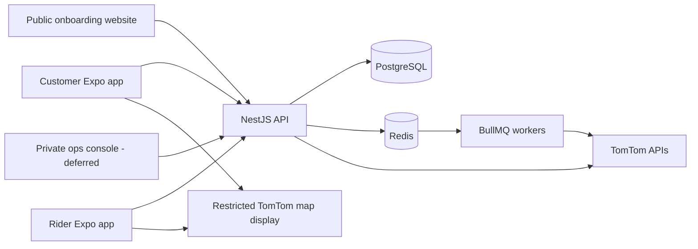

# Mobile, onboarding web, and TomTom implementation plan

## Outcome

Wash & Go will ship customer and rider experiences as React Native/Expo apps.
The public Next.js website will only onboard people and route them to the apps.
TomTom powers address search and route intelligence through backend adapters;
clients never own dispatch rules or privileged provider credentials.

## Target topology



## Repository shape

```text
apps/
  customer-mobile/     # Expo Router; booking, payment, tracking
  rider-mobile/        # Expo Router; runs, scan, location, earnings
  ops-console/         # deferred private tool, never the public website
packages/
  api-client/          # generated TypeScript client from OpenAPI
  domain/              # shared value objects and non-secret validation
  ui/                  # design tokens and genuinely shared primitives
  maps/                # renderer interface, sources, attribution helpers
backend/               # NestJS API and BullMQ processors
landing-page/          # public onboarding-only Next.js site
frontend/              # archived legacy reference
```

Avoid a generic `packages/shared/`; packages should describe their ownership.
Business rules remain in the backend even when input schemas or display types
are shared.

## Website scope

The public website may provide:

- product explanation, pricing guidance, FAQs, DOST/AZUL story, and trust copy;
- a service-coverage check using a backend endpoint;
- customer interest/sign-up, partner-shop application, and rider application;
- privacy/terms consent and notification preferences;
- App Store/Play Store links, QR codes, and deferred deep links.

It must not provide booking, checkout, live order tracking, dispatch, shop order
processing, remittance, zone editing, or admin features. Onboarding submissions
produce a pending backend record and a resumable mobile-app handoff; they do not
silently create an activated rider, shop, or privileged account.

## React Native and Expo approach

- Use TypeScript, Expo Router, and Expo development builds from the first maps,
  camera, background-location, or push-notification integration. Expo Go is a
  learning sandbox, not the project runtime.
- Keep customer and rider apps separate. Share tokens, API client, telemetry
  conventions, auth session handling, and maps interfaces.
- Generate the TypeScript API client from NestJS OpenAPI in CI. Contract drift
  should fail type checking before release.
- Store refresh/session secrets in platform-secure storage. The backend verifies
  roles and ownership for every action; hiding a mobile screen is not security.
- Design offline rider actions as an ordered, idempotent queue. QR handoffs and
  status changes sync to the server, which validates current order state.

## TomTom boundary

Create a backend interface such as:

```ts
interface MapsProvider {
  searchAddress(input: SearchAddressInput): Promise<AddressCandidate[]>;
  reverseGeocode(point: GeoPoint): Promise<AddressCandidate>;
  calculateRoute(input: RouteInput): Promise<RoutePlan>;
  calculateMatrix(input: MatrixInput): Promise<RouteMatrix>;
  optimizeWaypoints(input: WaypointInput): Promise<WaypointPlan>;
}
```

The TomTom adapter owns provider request/response translation. Domain code sees
normalized `AddressCandidate`, `RoutePlan`, and `WaypointPlan` types, not TomTom
JSON. Persist provider name, request hash, calculation time, distance, duration,
ordered waypoint IDs, and route geometry so results are auditable.

### Address flow

1. Mobile/web sends query text or coordinates to the backend.
2. Backend biases/restricts search to the Philippines and the supported
   Zamboanga geometry.
3. User selects a candidate; backend reverse-geocodes and normalizes it.
4. Backend checks the coordinate against the service-zone polygon.
5. PostgreSQL stores the user label, formatted address, latitude/longitude,
   provider metadata, zone ID, and validation status.

Debounce input, require a minimum query length, cache common results, and never
interpret a geocoding match as proof that the address is serviceable.

### Route flow

- Use TomTom Calculate Route for ETA, distance, and route geometry.
- Compute routes when a run is created or materially changed, not on every
  rider location ping.
- A normal Piaggio run of about ten intermediate stops fits TomTom Waypoint
  Optimization's default twelve-waypoint ceiling only when origin and
  destination are counted carefully. Enforce the limit in code.
- For larger or pickup-and-return problems, use Matrix Routing plus a backend
  heuristic/solver in a later phase. Do not market the MVP as a full vehicle
  routing problem solver.
- Recalculate only after dispatch changes, a route expires, or operations
  explicitly requests it. Cache by rounded coordinates and request options.

### Map display and navigation

Run a real-device spike with MapLibre React Native and TomTom Map Display tiles.
Acceptance requires Android and iOS rendering, correct attribution, acceptable
startup/pan performance, route overlays, markers, and documented key controls.
Start with raster tiles if that is the most reliable compliant integration;
adopt vector styling only after proving compatibility.

For the MVP, the rider app displays ordered stops and route context, then opens
the rider's chosen navigation app for turn-by-turn guidance. A native bridge to
TomTom's Android/iOS Navigation SDK is a later decision, not an MVP dependency.

## Key and cost controls

- Separate keys by environment, platform, and purpose.
- Keep Search, geocoding, routing, matrix, and optimization keys server-side.
- Restrict the client display key to Map Display and the intended applications
  where TomTom controls permit it.
- Apply quotas, request timeouts, retries with jitter, circuit breaking,
  monitoring, and usage alerts.
- Cache stable geocodes and route computations. Never call optimization from a
  render loop or live-location heartbeat.
- Proxy public website coverage/search requests through the backend with rate
  limits and abuse detection.

## Delivery phases

### Phase A — proof and foundation

- Create the Expo monorepo shape and both development builds.
- Generate an OpenAPI TypeScript client and authenticate against a local API.
- Test at least 30 representative Zamboanga addresses and 10 real routes.
- Prove MapLibre/TomTom rendering and attribution on one Android and one iOS
  device; document result, latency, accuracy, and estimated request cost.
- Define manual shop/admin operating procedures for the pilot.

Exit: the team can sign in, search/select a serviceable address, display it on a
map, and obtain a backend-computed route on both platforms.

### Phase B — customer pilot

- Customer onboarding, address book, coverage result, booking, status timeline,
  PayMongo payment, notifications, and support contact.
- Website customer interest flow and app-store handoff.
- No live map until status tracking and operational data are reliable.

Exit: a real scheduled order completes end to end with an auditable record.

### Phase C — rider pilot

- Daily run, ordered stops, route display, external-navigation deep link,
  background location batching, QR handoffs, and offline action queue.
- Worker-generated route plans with cache and recalculate controls.

Exit: a rider can finish a run through intermittent connectivity without
duplicating or skipping a valid handoff.

### Phase D — operational scale

- Partner and rider application review, route metrics, exception handling, and
  a minimal private ops console only if validated operational load requires it.
- Matrix/waypoint optimization evaluation based on actual runs and TomTom spend.
- Decide whether embedded TomTom turn-by-turn creates enough value to justify a
  native bridge and additional licensing/maintenance.

## Acceptance metrics

- Address candidate success rate and service-zone decision accuracy from the
  Zamboanga test set are recorded before pilot approval.
- No privileged TomTom key appears in a web/mobile bundle or repository.
- Every route request has a request hash, cache outcome, provider, latency,
  status, and cost-observability event.
- Public routes contain no customer booking, tracking, shop, or admin screens.
- Both mobile apps pass type checking, unit tests, and Android/iOS smoke tests.
- Rider offline-queue tests cover retries, duplicates, ordering, expiry, and
  conflict responses.

## Decisions still requiring field evidence

- The numeric pass threshold for Zamboanga address accuracy after the test set
  is assembled.
- Raster versus vector TomTom display after the device spike.
- Whether live customer rider-location display is worth privacy, battery, and
  support cost during the pilot.
- When private operations volume justifies building `apps/ops-console/`.

## Primary technical references

- [Expo development builds](https://docs.expo.dev/develop/development-builds/introduction/)
- [MapLibre React Native setup](https://maplibre.org/maplibre-react-native/docs/setup/getting-started/)
- [TomTom Search API](https://developer.tomtom.com/search-api/documentation/product-information/introduction)
- [TomTom Reverse Geocoding API](https://developer.tomtom.com/reverse-geocoding-api/documentation/tomtom-maps/v1/reverse-geocode)
- [TomTom Routing API](https://developer.tomtom.com/routing-api/documentation/tomtom-orbis-maps/v3/calculate-route)
- [TomTom Waypoint Optimization](https://developer.tomtom.com/waypoint-optimization/documentation/waypoint-optimization)
- [TomTom Map Display raster tiles](https://developer.tomtom.com/map-display-api/documentation/tomtom-maps/v2/raster/map-tile)
- [TomTom API key practices](https://developer.tomtom.com/platform/documentation/api-best-practices/api-key-management-best-practices)
- [TomTom pricing](https://developer.tomtom.com/pricing)
