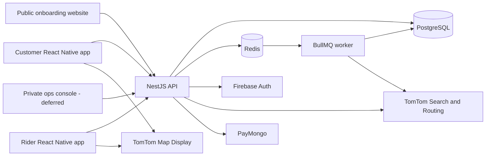

# System architecture overview

This page keeps the top-level picture short. Detailed implementation patterns
belong in linked documents and must retain their own status.

## High-level flow

## Boundaries

- PostgreSQL is the canonical business-data store.
- NestJS owns pricing, authorization, dispatch, commission, scheduling, and
  payment validation.
- Clients are thin interaction layers and must not own business truth.
- Redis supports background jobs and realtime fan-out, not permanent records.
- Workers process slow, scheduled, or retryable operations.
- External providers are accessed through backend adapters so provider changes
  do not leak across every client.
- Privileged TomTom calls are server-side. Mobile display keys are separated,
  product-restricted, monitored, and limited to map rendering.
- The public website is an onboarding channel, not an operations dashboard.

## Proposed backend organization

**Status: Proposed — not yet an implementation requirement.**

ADR-003 proposes organizing NestJS as a modular monolith with domain-owned
modules. Controllers and workers would call services; services would call
repositories or provider adapters; only repositories would access Prisma for
domain persistence. REST/OpenAPI is proposed for UI clients, and Nginx would be
optional only for self-hosted deployment.

See [`BACKEND_MODULAR_MONOLITH_PROPOSAL.md`](./BACKEND_MODULAR_MONOLITH_PROPOSAL.md)
for the simple explanation, dependency rules, tradeoffs, and review questions.

## Planned deployable units

| Unit                       | Responsibility                                                       |
| -------------------------- | -------------------------------------------------------------------- |
| NestJS API                 | Requests, validation, orchestration, maps proxy, and WebSockets      |
| BullMQ worker              | Notifications, schedules, route preparation, and reconciliation      |
| Next.js onboarding website | Discovery, coverage checks, applications, consent, and app handoff   |
| React Native customer app  | Booking, payment, tracking, and account experience                   |
| React Native rider app     | Dispatch, route context, scanning, location, and status changes      |
| Private ops console        | Deferred authenticated shop/admin tool; separate from the public web |

Hosting remains a deliberate open decision. See `PLAN.md` before adding
provider-specific assumptions.
